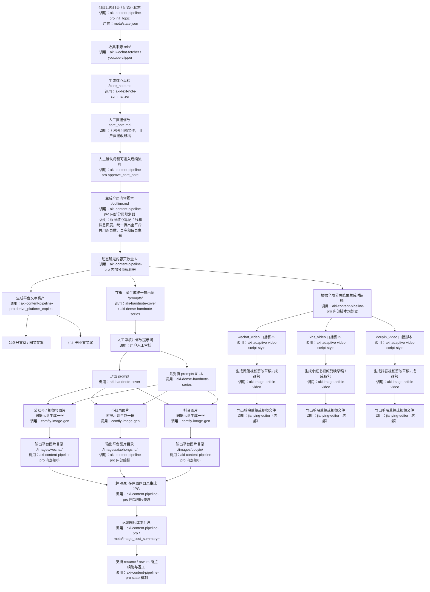

# Aki Content Pipeline Pro 迭代计划

## 本轮目标

这轮先不动“公众号贴图发布链路”，只重构创作与生图主链路。  
核心原则：

1. 先在话题根目录产出统一母稿和统一分页。
2. 全平台共用同一套内容页数量与页序。
3. 先把提示词做对，再生图，不做生图后的质量闸门。
4. 生图完成后，再根据图片节点生成平台化口播脚本。

## 本轮不做

1. 不改 `publish_wechat_drafts` 的实现。
2. 不做发布报告标准化。
3. 不做生图后 `quality gate`。
4. 不做自动发布到小红书/抖音/视频号。
5. 删除“生成问题清单到 `meta/core_note_co_create_questions.md`”这一环节，用户直接修改 `core_note.md`。

## 目标流程图



## 产物流

### 话题根目录作为主资产区

```text
<topic_root>/
  core_note.md
  outline.md
  prompts/
    cover_prompt.md
    series_01_prompt.md
    ...
    series_N_prompt.md
  copies/
    wechat_article.md
    wechat_imagepost_copy.md
    xiaohongshu_post.md
  images/
    wechat/
      cover_01.png
      cover_01.jpg
      series_01.png
      series_01.jpg
      ...
      series_N.png
      series_N.jpg
    xiaohongshu/
      cover_01.png
      cover_01.jpg
      series_01.png
      series_01.jpg
      ...
      series_N.png
      series_N.jpg
    douyin/
      cover_01.png
      cover_01.jpg
      series_01.png
      series_01.jpg
      ...
      series_N.png
      series_N.jpg
  video/
    wechat/
      timeline.json
      voice_wechat_video.md
      output/
    xiaohongshu/
      timeline.json
      voice_xhs_video.md
      output/
    douyin/
      timeline.json
      voice_douyin_video.md
      output/
  refs/
  meta/
```

### 平台派生产物

平台目录不再各自决定页数，只消费根目录已经确定好的内容结构：

1. `mp_weixin` 读取根目录 `core_note.md + prompts + images`
2. `xiaohongshu` 读取同一套 `prompts + images`
3. `channels_weixin / xhs_video / douyin` 分别读取各自平台目录下的 `timeline.json + 平台脚本 + 对应平台图片目录`
4. 视频链路继续沿用现有做法：平台脚本和图片进入 `aki-image-article-video`，剪映草稿写入本机 JianYing Projects 根目录，再由 `jianying-editor` 导出视频文件。
5. 断点续跑与返工状态继续由 `meta/state.json` 维护，不因为根目录重构而丢失。
6. 视频来源如果自动抽取逐字稿失败，仍保留“写入手工补录占位文件并阻断后续流程”的兜底逻辑。

## 关键约束

1. 内容页数量只算一次，采用动态分析，不允许公众号和小红书各算各的。
2. 图片提示词默认白底。修改以下skill里调用的风格的模版
  - aki-handnote-cover
  - aki-dense-handnote-series
3. 安全留白按像素控制，当前默认 `48px`。
4. 单图体积阈值是 `4MB`，超过则自动转高质量 JPG。
   JPG 文件直接放在原 PNG 同目录下，不单独放 `upload_ready/` 子目录。
6. 根目录统一提示词由两个 skill 负责：
   - 封面：`aki-handnote-cover`
   - 系列页：`aki-dense-handnote-series`
7. 同一套提示词当前默认生成三份平台图片：
   - 公众号 / 视频号共用一份
   - 小红书一份
   - 抖音一份
8. 后续如果不同平台需要不同视觉风格，再作为下一轮迭代处理。
9. 生图后仍保留成本汇总、续跑、返工这类流程管理能力。
10. 剪映草稿不保存在话题目录内，默认写入：
    `/Users/aki/Movies/JianyingPro/User Data/Projects/com.lveditor.draft`
    如需迁移机器，继续通过 `JY_PROJECTS_ROOT` 覆盖。

## 口播脚本生成逻辑

视频脚本不再只对着文章写，而是对着图片节点写。

默认逻辑：

1. 开头 `3-5 秒` 对应封面图。
2. 后续每一张系列图对应一段口播。
3. 每段脚本都要知道自己绑定的是哪一张图。
4. 同一套时间轴派生三份平台脚本：
   - `wechat_video`
   - `xhs_video`
   - `douyin_video`
5. 每份平台脚本生成后，都继续进入剪映草稿 / 视频包阶段，不在脚本生成处结束。
